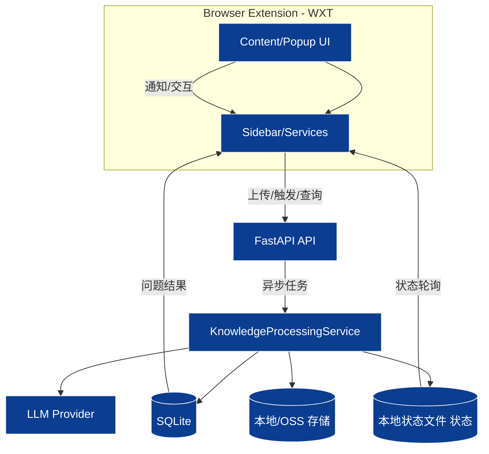
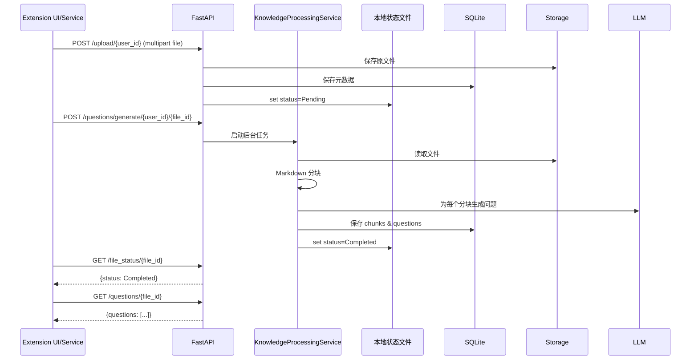

# InsightFlow

## Current Backend Database

Backend file metadata, chunks, and generated questions are stored in SQLite,
not MySQL. The default database path is `./data/insight_flow.sqlite3`; override
it with `SQLITE_DB_PATH`. Existing MySQL data is not migrated automatically.

## Current Backend Status Storage

Backend file processing status is stored in a local JSON file, not Redis.
The default path is `./status_store/file_statuses.json`; override the directory
with `LOCAL_STATUS_STORE_DIR`.

InsightFlow 是一个帮助自媒体/知识工作者进行深度阅读与思考的项目，包含：
- 浏览器扩展（前端，WXT + Vue3）：提取网页主体内容，提供沉浸式阅读与侧边栏问题/回答面板
- 知识处理服务（后端，FastAPI）：接收 Markdown 文档，分块、调用 LLM 生成启发式问题，存储与查询

本 README 与仓库当前源码结构完全对齐（前端位于 src/extension，后端位于 src/server，前端使用 WXT 而非 Vite）。


## 目录结构

```
.
├─ src/
│  ├─ fe/                        # 浏览器扩展前端（WXT + Vue3）
│  │  ├─ entrypoints/
│  │  │  ├─ popup/               # 扩展弹窗
│  │  │  └─ services/
│  │  │     └─ apiService.ts     # 前端 API 封装（可切换模拟/真实后端）
│  │  ├─ public/                 # 扩展图标与静态资源（wxt.publicDir）
│  │  ├─ wxt.config.ts           # WXT 配置（清单、权限、CSP、别名等）
│  │  ├─ package.json            # 前端脚本（wxt dev/build/zip）
│  │  └─ ...                     # 组件、hooks、utils、extractors、immersive 等
│  │
│  └─ be/                        # 后端：FastAPI 知识处理服务
│     ├─ api_services/
│     │  ├─ main.py                # FastAPI 入口（uvicorn --app-dir src）
│     │  ├─ file_routes.py         # 文件/问题/LLM 流式等 REST 路由
│     │  └─ shared_resources.py    # 资源初始化（DB/本地状态文件/存储/日志/异步任务）
│     ├─ common/                   # SQLite/本地状态文件/存储 抽象与实现
│     │  ├─ insight_sqlite_repository.py # SQLite 连接/模型/CRUD
│    │  ├─ file_status_store.py   # local JSON status store (LOCAL_STATUS_STORE_DIR)
│     │  ├─ storage_manager.py     # 本地/OSS 存储选择（STORAGE_TYPE）
│     │  ├─ local_storage.py
│     │  └─ oss_storage.py
│     ├─ llm_knowledge_processing/ # 文档分块、LLM 生成问题、流水线服务
│     │  ├─ knowledge_processing_service.py
│     │  ├─ markdown_splitter.py
│     │  ├─ question_generator.py
│     │  ├─ llm_client.py
│     │  ├─ llm_config_manager.py
│     │  └─ config_manager.py
│     ├─ scripts/                  # OpenAPI 生成脚本
│     └─ tests/                    # 后端测试样例
│
├─ ai_sdk/                       # 可编辑安装的 SDK 子项目（pip install -e ai_sdk）
├─ deepsearch_agent/  [EXPERIMENTAL]  # 深度检索/研究 Agent 原型模块（搜索聚合、研究代理、抓取工具）
│  ├─ research_agent.py
│  ├─ base_search_provider.py
│  ├─ tools_web_search.py
│  └─ ...                        # 其他 provider 与配置
├─ requirements.txt              # 后端依赖
├─ README.md
└─ LICENSE
```

提示：WXT 构建产物默认位于 .output/ 下（按浏览器区分，如 .output/chrome-mv3）。
+补充：仓库还包含 deepsearch_agent 原型模块，使用示例与说明见 deepsearch_agent/README.md。  
> ⚠️ **[EXPERIMENTAL]** 本模块为早期实验原型，与 src/ 主产品完全独立、互不依赖。当前状态：
> - 依赖免费/低额度 API（智谱、Metaso），效果有限
> - 多 agent 调度为手写实现，未使用成熟框架
> - 提示词中英文混杂、缺少校验逻辑
> - 计划后续用 langchain/deepagents 等框架重写，届时本目录将被替换或移除
> - 暂不对其功能稳定性做任何承诺


## 快速开始

### 后端（FastAPI）最小可运行

前置条件：
- Python 3.10+
- 可用的 SQLite、本地状态文件 实例

重要默认值与注意：
- SQLite 数据库通过环境变量配置：
  - SQLITE_DB_PATH（默认 ./data/insight_flow.sqlite3）
  - 首次启动会自动创建父目录和数据库表
  - 本次不提供 MySQL 到 SQLite 的自动迁移脚本
- 本地状态文件 连接默认 LOCAL_STATUS_STORE_DIR=./status_store（可通过环境变量覆盖）
- 存储默认使用本地目录 ./upload_file（可通过 STORAGE_TYPE/LOCAL_STORAGE_BASE_DIR 调整）
- 硬编码后续会调整为环境变量配置

安装依赖：
```bash
python -m venv .venv
# Windows PowerShell:
. .venv/Scripts/Activate.ps1
# macOS/Linux:
# source .venv/bin/activate

pip install -r requirements.txt
# 可选：安装子项目 SDK（可编辑方式）
pip install -e ai_sdk
# 注意：ai_sdk 子项目的 Python 要求为 >=3.12（见 ai_sdk/pyproject.toml），如当前环境为 3.10/3.11 请在独立虚拟环境中安装与运行
# 或者（如使用 uv）：
# uv pip install -r requirements.txt
# uv pip install -e ai_sdk
```

启动（推荐使用 --app-dir 确保 src 在 sys.path 中）：
```bash
# 开发：
python -m uvicorn server.main:app --app-dir src --host 0.0.0.0 --port 8000

# 或直接运行入口模块（同样需要保证 PythonPath 包含 src）：
# PYTHONPATH=src python src/server/main.py  # macOS/Linux
# $env:PYTHONPATH="src"; python src/server/main.py  # Windows PowerShell
```

验证：
- 打开 http://localhost:8000/docs 可见 Swagger UI
- 首次启动会自动创建 SQLite 表（file_metadata / chunks / questions）
- 日志由 shared_resources/fastapi_logger 配置（查看相关 log 输出）

### 前端（浏览器扩展，WXT + Vue3）

前端位于 src/extension，使用 WXT 脚本（非 Vite）。常用脚本如下：
- dev：启动开发模式（自动打开浏览器并加载扩展）
- build：构建产物到 .output/ 下
- zip：打包为可分发 zip

步骤：
```bash
cd src/extension
npm install
npm run dev        # 开发：WXT 会自动启动并加载扩展
# 或构建后手动加载：
npm run build
# Chrome: chrome://extensions -> 开发者模式 -> 加载已解压扩展 -> 选择 .output/chrome-mv3 目录
# Firefox（如启用 build:firefox）：about:debugging#/runtime/this-firefox -> 临时加载附加组件
```

WXT 权限与清单在 src/extension/wxt.config.ts 中维护：
- permissions: activeTab, scripting, storage, tabs, notifications
- host_permissions: <all_urls>, about:blank
- CSP 对开发端口做了放开，便于调试


## 接入真实后端 API（替换默认本地模拟逻辑）

前端 API 封装位于：
- src/extension/entrypoints/services/apiService.ts

可根据需要，将其从“模拟/本地逻辑”改为请求后端：
```ts
// 示例（可按需调整）
const BASE_URL = "http://localhost:8000";
// 提示：默认代码中存在远程示例地址（如 http://39.107.59.41:18080），接入真实后端时请替换为你的本地或自有后端地址，避免跨域与安全风险

export async function uploadMarkdown(userId: string, file: File) {
  const form = new FormData();
  form.append("file", file);
  const res = await fetch(`${BASE_URL}/upload/${encodeURIComponent(userId)}`, {
    method: "POST",
    body: form,
  });
  if (!res.ok) throw new Error(await res.text());
  return res.json();
}

export async function triggerGenerate(userId: string, fileId: string) {
  const res = await fetch(`${BASE_URL}/questions/generate/${encodeURIComponent(userId)}/${encodeURIComponent(fileId)}`, { method: "POST" });
  if (!res.ok) throw new Error(await res.text());
  return res.json();
}

export async function getFileStatus(fileId: string) {
  const res = await fetch(`${BASE_URL}/file_status/${encodeURIComponent(fileId)}`);
  if (!res.ok) throw new Error(await res.text());
  return res.json(); // { file_id, status }
}

export async function getQuestions(fileId: string) {
  const res = await fetch(`${BASE_URL}/questions/${encodeURIComponent(fileId)}`);
  if (!res.ok) throw new Error(await res.text());
  return res.json(); // { file_id, questions: [...] }
}
```

前端联动流程参考：
1) 选择/拖拽上传 Markdown（uploadMarkdown）
2) 返回 file_id 后，手动触发生成（triggerGenerate）
3) 轮询 file_status 为 Completed（getFileStatus）
4) 获取问题列表（getQuestions）并展示


## 架构与数据流

原理（简述）：
- 前端（WXT 扩展）：内容脚本提取页面主体，提供沉浸式阅读，并在侧栏展示问题/回答。默认可使用本地/模拟问题/回答以便独立演示。
- 后端：接收 Markdown，保存到存储，记录元数据到 SQLite，通过后台任务调用 LLM 按分块生成问题，入库并使用 本地状态文件 记录处理进度，供前端轮询。

架构图：

```mermaid
flowchart TD
  subgraph Browser_Extension [Browser Extension - WXT]
    A[Content/Popup UI] --> B[Sidebar/Services]
  end
  B -->|上传/触发/查询| D[FastAPI API]
  A -->|通知/交互| B

  D -->|异步任务| E[KnowledgeProcessingService]
  E --> F[LLM Provider]
  E --> G[(SQLite)]
  E --> H[(本地状态文件 状态)]
  E --> I[(本地/OSS 存储)]

  H -->|状态轮询| B
  G -->|问题结果| B

  classDef dark fill:#0b3d91,stroke:#f5f5f5,color:#ffffff;
  class A,B,D,E,F,G,H,I dark;
```

处理流水线时序：

```mermaid
sequenceDiagram
  participant FE as Extension UI/Service
  participant API as FastAPI
  participant KPS as KnowledgeProcessingService
  participant R as 本地状态文件
  participant DB as SQLite
  participant ST as Storage
  participant LLM as LLM

  FE->>API: POST /upload/{user_id} (multipart file)
  API->>ST: 保存原文件
  API->>DB: 保存元数据
  API->>R: set status=Pending
  FE->>API: POST /questions/generate/{user_id}/{file_id}
  API->>KPS: 启动后台任务
  KPS->>ST: 读取文件
  KPS->>KPS: Markdown 分块
  KPS->>LLM: 为每个分块生成问题
  KPS->>DB: 保存 chunks & questions
  KPS->>R: set status=Completed
  FE->>API: GET /file_status/{file_id}
  API-->>FE: {status: Completed}
  FE->>API: GET /questions/{file_id}
  API-->>FE: {questions: [...]}
```


## API 一览（后端实际实现）

- POST /upload/{user_id}
  - form-data: file (UploadFile)
  - 返回: { file_id, filename, size, type, upload_time, stored_filename, status }
- GET /files/
  - 返回: FileMetadataResponse[]
- GET /files/{user_id}
  - query: skip, limit
  - 返回: FileMetadataResponse[]
- GET /files/{user_id}/{file_id}
  - 返回: FileMetadataResponse
- DELETE /delete/{user_id}/{file_id}
  - 返回: { message }
- GET /file_status/{file_id}
  - 返回: { file_id, status }
- GET /download/{user_id}/{file_id}
  - 返回: 文件流（Content-Disposition 附件）
- POST /questions/generate/{user_id}/{file_id}
  - 返回: { message }
- GET /questions/{file_id}
  - 前置：本地状态文件 中状态需为 Completed
  - 返回: { file_id, questions: [{question_id,question,label,chunk_id}, ...] }
- POST /llm/query
  - body: { question_id, chunk_id }
  - 返回: 上游 OpenAI 格式 JSON
- POST /llm/query/stream
  - body: { question_id, chunk_id }
  - 返回: text/event-stream（OpenAI chunk 兼容）

示例（cURL）：
```bash
# 上传文件
curl -F "file=@./README.md" http://localhost:8000/upload/demo_user

# 触发生成
curl -X POST http://localhost:8000/questions/generate/demo_user/<file_id>

# 查询状态
curl http://localhost:8000/file_status/<file_id>

# 获取问题
curl http://localhost:8000/questions/<file_id>

# 删除文件及其数据
curl -X DELETE http://localhost:8000/delete/demo_user/<file_id>
```


## 配置与环境变量

后端主要配置项：
- SQLite
  - SQLITE_DB_PATH（默认 ./data/insight_flow.sqlite3）
  - 首次启动会自动创建 file_metadata / chunks / questions 三张表
  - 不自动迁移历史 MySQL 数据
- 本地状态文件
  - LOCAL_STATUS_STORE_DIR（默认 ./status_store）
  - 状态 TTL 由代码控制（set_file_status 默认 7 天）
- 存储
  - STORAGE_TYPE：local 或 oss（默认 local）
  - LOCAL_STORAGE_BASE_DIR：本地存储根目录（默认 ./upload_file）
  - 若使用 OSS：
    - OSS_ACCESS_KEY_ID
    - OSS_ACCESS_KEY_SECRET
    - OSS_ENDPOINT（默认 http://oss-cn-hangzhou.aliyuncs.com）
    - OSS_BUCKET_NAME
- LLM 提供商与模型（在代码/环境变量中配置）
  - 参考 src/server/llm_knowledge_processing/llm_config_manager.py 与 config_manager.py
  - 示例环境：
    - LLM_API_URL（默认 https://api.siliconflow.cn/v1/）
    - LLM_API_KEY（需自行提供，切勿硬编码到仓库或日志，建议使用环境变量/Secret 管理）
    - LLM_MODEL、LLM_TEMPERATURE、OPENAI_MAX_TOKENS 等

前端（WXT）清单/权限：
- 位于 src/extension/wxt.config.ts 的 manifest 块
- 默认 permissions: notifications, activeTab, scripting, storage, tabs
- host_permissions: ["<all_urls>", "about:blank"]
- 扩展页面 CSP 已放开本地开发端口脚本加载限制


## 开发与调试

后端：
```bash
# 安装依赖
pip install -r requirements.txt

# 启动服务（开发）
python -m uvicorn server.main:app --app-dir src --host 0.0.0.0 --port 8000

# 查看交互文档
open http://localhost:8000/docs   # macOS
# Windows: start http://localhost:8000/docs
```

前端（WXT）：
```bash
cd src/extension
npm install
npm run dev
# 或构建后在 Chrome 加载 .output/chrome-mv3 目录
```

调试建议：
- 后端日志：shared_resources/fastapi_logger 输出；必要时提高日志级别
- 本地状态文件：使用 CLI 观察 file_id 对应状态键
- SQLite：检查 file_metadata / chunks / questions 三张表
- CORS：后端已允许 *（GET/POST，allow_credentials=False）
- Python 导入：使用 uvicorn --app-dir src 或设置 PYTHONPATH=src，避免 server.* 导入失败


## 常见问题（Troubleshooting）

- ImportError: No module named 'server.api_services...'
  - 使用 uvicorn --app-dir src 或设置 PYTHONPATH=src 再启动
- /questions/{file_id} 返回 500 或空
  - 需等 /file_status/{file_id} 为 Completed 后再请求
  - 确认数据库中 chunks 与 questions 已生成
- SQLite 初始化失败
  - 通过 SQLITE_DB_PATH 指向可写路径，或检查 ./data 目录权限
- 本地状态文件 连接失败
  - 通过 LOCAL_STATUS_STORE_DIR 环境变量指向可写目录
- 本地存储无权限/路径不存在
  - 调整 LOCAL_STORAGE_BASE_DIR 或确保进程有写权限
- 浏览器扩展加载异常（资源/脚本找不到）
  - WXT 模式下无需手工复制静态资源；使用 npm run dev 或从 .output/ 目录加载
- 生产部署
  - 建议：Nginx 反向代理 + 多 worker（uvicorn/gunicorn）+ 进程守护（systemd/supervisor）
  - 如使用 gunicorn：需自行加入依赖（requirements 未固定），并使用 -k uvicorn.workers.UvicornWorker


## 10 组测试用例（含预期结果）

1. 上传同一用户的同名文件两次
   - 操作：POST /upload/{user} 两次，文件相同
   - 预期：第二次返回 status=File Already exists，file_id 与第一次一致

2. 上传后立即获取状态
   - 操作：POST /upload → GET /file_status/{file_id}
   - 预期：status=Pending 或 Processing

3. 触发生成任务并轮询至完成
   - 操作：POST /questions/generate → 间隔 2s GET /file_status
   - 预期：最终 status=Completed

4. 生成完成后获取问题
   - 操作：GET /questions/{file_id}
   - 预期：返回 {file_id, questions:[{question_id,question,label,chunk_id}...]}，长度≥1

5. 获取指定用户的文件清单
   - 操作：GET /files/{user_id}?skip=0&limit=50
   - 预期：返回该用户上传过的文件元数据数组，字段齐全

6. 获取所有文件清单（全局）
   - 操作：GET /files/
   - 预期：返回所有文件的元数据数组

7. 下载文件
   - 操作：GET /download/{user}/{file_id}
   - 预期：响应 200，包含附件头 Content-Disposition，流长度>0

8. 删除文件及数据
   - 操作：DELETE /delete/{user}/{file_id}
   - 预期：返回 message=File ... deleted successfully；数据库中对应 chunks/questions 级联清理；本地状态文件 状态删除

9. 前端 WXT 开发模式验证
   - 操作：src/extension 运行 npm run dev，打开扩展 UI，进行上传/触发/轮询/获取问题的端到端流程（后端需先启动）
   - 预期：UI 可见状态变化，问题列表非空

10. 前端接入真实后端（修改 apiService.ts）
   - 操作：将 BASE_URL 指向后端；上传→触发→轮询→展示问题
   - 预期：侧边栏/弹窗展示来自后端 DB 的问题数据，状态变化与后端一致


## 贡献

- 欢迎提交 Issue / PR
- 变更前请先运行基本测试（后端 pytest），并更新相关文档
- 代码风格保持简单清晰，优先最小必要修改


## 许可证

本项目使用 ISC 许可证，详见 [LICENSE](LICENSE)


## 变更记录（相对旧版 README 的主要修订）

- 将前端构建说明从 Vite/cpx 更正为 WXT（src/extension 下的 wxt.config.ts 与 npm scripts）
- 修正后端启动命令，推荐 uvicorn --app-dir src 以保证 server.* 导入
- 明确 SQLite/本地状态文件 默认路径与环境变量覆盖范围
- 补充 LLM 同步/流式查询接口说明
- 更新目录结构、架构与时序 mermaid 图、故障排查与测试用例
