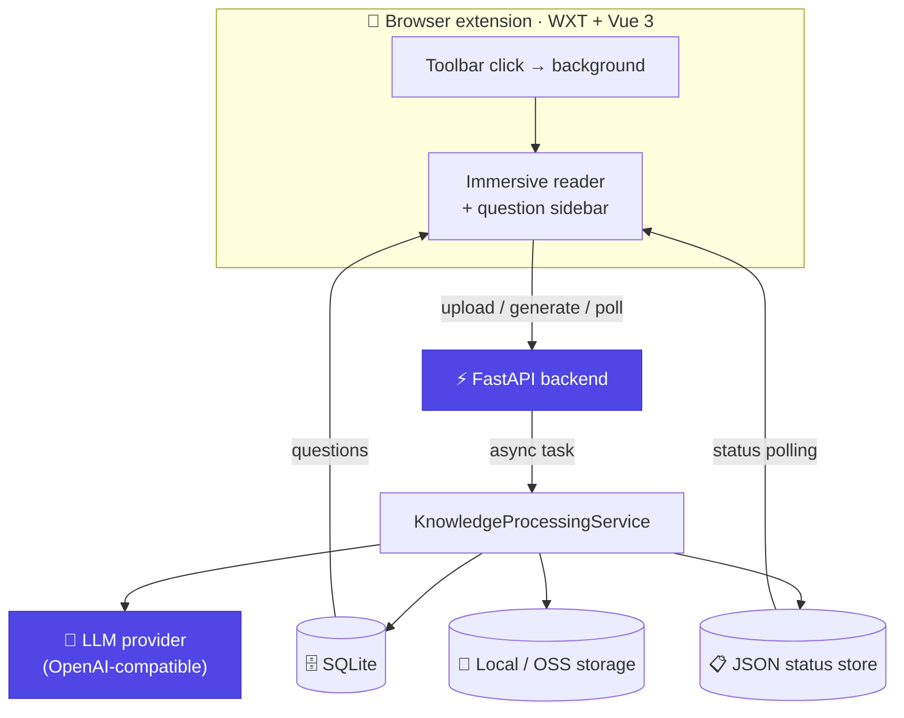
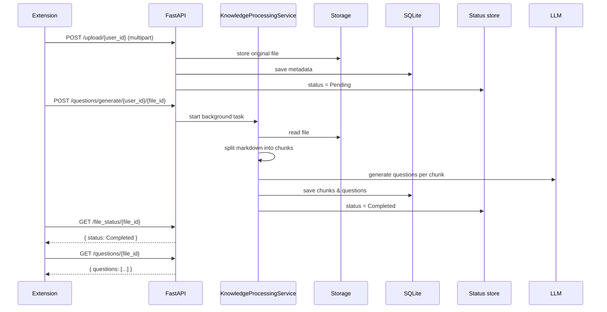

<div align="center">

# 💡 InsightFlow

### Turn any web article into AI‑crafted questions — read deeper, think sharper.

A browser extension **+** FastAPI service that extracts the main content of any page,
drops you into a distraction‑free **immersive reader**, and uses an LLM to generate
heuristic questions that push you from passive skimming to active thinking.

<p>


</p>

<p>
<a href="#-features">Features</a> ·
<a href="#-quick-start">Quick start</a> ·
<a href="#-architecture">Architecture</a> ·
<a href="#-api-reference">API</a> ·
<a href="#-configuration">Config</a> ·
<a href="#-deployment">Deploy</a>
</p>

</div>

---

## 🧭 What is InsightFlow?

InsightFlow helps self‑learners, writers, and knowledge workers read the web more
deeply. Click the toolbar icon on any article and InsightFlow:

1. **Extracts** the main readable content (Readability / Defuddle + per‑site rules).
2. **Reframes** it into a clean, full‑screen **immersive reader**.
3. **Generates questions** with an LLM — chunk by chunk — so you engage with the
   ideas instead of gliding past them.

Two parts, one repo:

| Part | Stack | What it does |
| :--- | :--- | :--- |
| 🧩 **Extension** · `src/extension` | WXT · Vue 3 · MV3 | Content extraction, immersive reader, draggable question sidebar |
| ⚡ **Backend** · `src/server` | FastAPI · SQLAlchemy / SQLite | Upload, chunking, LLM question generation, streaming answers |

---

## ✨ Features

- 🪄 **One‑click immersive reading** — a toolbar click injects a clean reader over any page; `Esc` or the ✕ button exits.
- 🤖 **LLM question generation** — heuristic questions per content chunk, surfaced in a draggable sidebar with a shimmer loading state while the model works.
- 🌊 **Streaming answers** — `/llm/query/stream` emits Server‑Sent Events (OpenAI‑compatible chunks) for token‑by‑token responses.
- 🔌 **Pluggable providers** — siliconflow / OpenAI / Zhipu / Ollama via env config (default: DeepSeek‑V3.2 on siliconflow).
- 🗄️ **Zero‑infra persistence** — SQLite + a local JSON status store; no MySQL or Redis required. Switch to Alibaba **OSS** storage with one env var.
- 🛡️ **Production‑ready ops** — hardened **systemd** unit, **Nginx + HTTPS** template, `/healthz` check, a minimal runtime lock, and a step‑by‑step Ubuntu runbook.

---

## 🏗️ Architecture


```mermaid
flowchart TD
    subgraph EXT["🧩 Browser extension · WXT + Vue 3"]
        A["Toolbar click → background"] --> B["Immersive reader<br/>+ question sidebar"]
    end

    B -->|"upload / generate / poll"| D["⚡ FastAPI backend"]
    D -->|"async task"| E["KnowledgeProcessingService"]
    E --> F["🤖 LLM provider<br/>(OpenAI-compatible)"]
    E --> G[("🗄️ SQLite")]
    E --> H[("📋 JSON status store")]
    E --> I[("📁 Local / OSS storage")]

    H -->|"status polling"| B
    G -->|"questions"| B

    classDef accent fill:#4f46e5,stroke:#4338ca,color:#ffffff;
    class D,F accent;
```

<details>
<summary><b>⏱️ Processing pipeline (sequence)</b></summary>


```mermaid
sequenceDiagram
    participant FE as Extension
    participant API as FastAPI
    participant KPS as KnowledgeProcessingService
    participant ST as Storage
    participant DB as SQLite
    participant R as Status store
    participant LLM as LLM

    FE->>API: POST /upload/{user_id} (multipart)
    API->>ST: store original file
    API->>DB: save metadata
    API->>R: status = Pending
    FE->>API: POST /questions/generate/{user_id}/{file_id}
    API->>KPS: start background task
    KPS->>ST: read file
    KPS->>KPS: split markdown into chunks
    KPS->>LLM: generate questions per chunk
    KPS->>DB: save chunks & questions
    KPS->>R: status = Completed
    FE->>API: GET /file_status/{file_id}
    API-->>FE: { status: Completed }
    FE->>API: GET /questions/{file_id}
    API-->>FE: { questions: [...] }
```

</details>

---

## 📁 Project structure

```text
.
├─ src/
│  ├─ extension/                  # Browser extension (WXT + Vue 3)
│  │  ├─ entrypoints/
│  │  │  ├─ popup/                # Popup (index.html→popupmain.ts→WinApp→MainPage; disabled via manifest.exclude)
│  │  │  ├─ services/apiService.ts   # Frontend API client (talks to the backend)
│  │  │  └─ background.ts         # Toolbar click → action.onClicked → inject immersive reader
│  │  ├─ immersive/               # Injected reading session (readingSession.cjs): reader + question sidebar
│  │  ├─ components/              # MainPage.vue / HomePage.vue
│  │  ├─ hooks/ extractor/ lib/ sidebar/ utils/   # Composables, content extraction, helpers
│  │  ├─ public/                  # Extension icons & static assets
│  │  └─ wxt.config.ts            # WXT manifest, permissions, CSP, aliases
│  ├─ server/                     # Backend: FastAPI knowledge-processing service
│  │  ├─ main.py                  # FastAPI entry (uvicorn server.main:app --app-dir src)
│  │  ├─ api_services/            # Routes: file / question / llm + shared_resources + logger
│  │  ├─ common/                  # SQLite / status store / storage abstractions
│  │  ├─ llm_knowledge_processing/   # Chunking, question generation, llm_client/llm_gateway, config
│  │  ├─ scripts/                 # start.sh / start.ps1 / generate_openapi.py
│  │  └─ tests/                   # Backend test samples
│  └─ .env                        # Shared front/back config (gitignored — never commit secrets)
│
├─ deploy/                        # Deploy templates: systemd / nginx / env example
├─ docs/deployment/               # Ubuntu + systemd deployment guide
├─ requirements.txt               # Full dev superset (incl. experimental subprojects & test tooling)
├─ requirements-server.in         # Backend runtime direct deps (source for `uv pip compile`)
├─ requirements-server.txt        # Minimal pinned backend runtime lock (used in production)
├─ ai_sdk/                        # Editable SDK subproject (pip install -e ai_sdk)
├─ deepresearch_agent/  [EXPERIMENTAL]   # Deep-research agent prototype (independent of src/)
├─ README.md
└─ LICENSE
```

---

## 🚀 Quick start

### 🧩 Backend (FastAPI)

> Requires **Python 3.12+**.

```bash
# 1) Virtualenv + minimal runtime deps
python -m venv .venv
source .venv/bin/activate                 # Windows: . .venv/Scripts/Activate.ps1
pip install -r requirements-server.txt    # full dev set: pip install -r requirements.txt

# 2) Config — create src/.env and set your LLM key
cat > src/.env <<'EOF'
SERVER_HOST=127.0.0.1
SERVER_PORT=8080
LLM_PROVIDER=siliconflow
LLM_API_URL=https://api.siliconflow.cn/v1
LLM_MODEL=deepseek-ai/DeepSeek-V3.2
LLM_API_KEY=sk-your-key-here
VITE_API_BASE_URL=http://localhost:8080
EOF

# 3) Run — convenience script (venv + .env + uvicorn) …
bash src/server/scripts/start.sh          # Windows: .\src\server\scripts\start.ps1
# … or directly:
python -m uvicorn server.main:app --app-dir src --host 0.0.0.0 --port 8080
```

Then open **http://localhost:8080/docs** for the Swagger UI. The SQLite tables
(`file_metadata` / `chunks` / `questions`) are created automatically on first run.

### 🧩 Extension (WXT + Vue 3)

```bash
cd src/extension
npm install
npm run dev          # WXT launches a browser with the extension loaded
# …or build and load manually:
npm run build        # → .output/chrome-mv3
# Chrome → chrome://extensions → Developer mode → Load unpacked → pick .output/chrome-mv3
```

Then open any article, click the **InsightFlow** toolbar icon to enter the
immersive reader, and hit the green **➕** to generate questions.

> 💡 The extension reads `VITE_API_BASE_URL` (from `src/.env`) at build time — point
> it at your backend before building for anything other than local dev.

---

## 🔌 API reference

<div align="center"><b>📂 Files</b></div>

| Method | Endpoint | Description |
| :--- | :--- | :--- |
| `POST` | `/upload/{user_id}` | Upload a file (multipart) → `{ file_id, status, … }` |
| `GET` | `/files/` | All file metadata |
| `GET` | `/files/{user_id}` | A user's files (`skip`, `limit`) |
| `GET` | `/files/{user_id}/{file_id}` | One file's metadata |
| `GET` | `/download/{user_id}/{file_id}` | Download the stored file |
| `DELETE` | `/delete/{user_id}/{file_id}` | Delete a file + cascade its chunks/questions |
| `GET` | `/file_status/{file_id}` | `Pending` / `Processing` / `Completed` / `Failed` |

<div align="center"><b>❓ Questions &nbsp;·&nbsp; 🤖 LLM &nbsp;·&nbsp; 🩺 Ops</b></div>

| Method | Endpoint | Description |
| :--- | :--- | :--- |
| `POST` | `/questions/generate/{user_id}/{file_id}` | Kick off background question generation |
| `GET` | `/questions/{file_id}` | Generated questions (once status = `Completed`) |
| `POST` | `/llm/query` | One‑shot answer (OpenAI‑format JSON) |
| `POST` | `/llm/query/stream` | Streaming answer (`text/event-stream`) |
| `GET` | `/healthz` | Health check |
| `GET` | `/docs` · `/openapi.json` | Swagger UI / OpenAPI schema |

<details>
<summary><b>📋 cURL walkthrough</b></summary>

```bash
# Upload
curl -F "file=@./README.md" http://localhost:8080/upload/demo_user
# Trigger generation
curl -X POST http://localhost:8080/questions/generate/demo_user/<file_id>
# Poll status
curl http://localhost:8080/file_status/<file_id>
# Fetch questions (after status = Completed)
curl http://localhost:8080/questions/<file_id>
# Delete file + data
curl -X DELETE http://localhost:8080/delete/demo_user/<file_id>
```

</details>

---

## ⚙️ Configuration

All backend config is read from environment variables (loaded from `src/.env` in
dev, or `/etc/insightflow/backend.env` in production).

| Variable | Default | Description |
| :--- | :--- | :--- |
| `SERVER_HOST` / `SERVER_PORT` | `127.0.0.1` / `8080` | Bind address |
| `SQLITE_DB_PATH` | `./data/insight_flow.sqlite3` | SQLite file (parent dir auto‑created) |
| `LOCAL_STATUS_STORE_DIR` | `./status_store` | JSON status store directory |
| `LOCAL_STORAGE_BASE_DIR` | `./upload_file` | Uploaded files directory |
| `LOCAL_COMPLETED_DIR` | `./completed` | Processed‑file archive directory |
| `STORAGE_TYPE` | `local` | `local` or `oss` |
| `OSS_ACCESS_KEY_ID` / `_SECRET` / `_ENDPOINT` / `_BUCKET_NAME` | — | Alibaba OSS (when `STORAGE_TYPE=oss`) |
| `LLM_PROVIDER` | `siliconflow` | `siliconflow` · `openai` · `zhipu` · `ollama` |
| `LLM_API_URL` | `https://api.siliconflow.cn/v1` | Provider base URL |
| `LLM_API_KEY` | — | Provider key — **never commit** |
| `LLM_MODEL` | `deepseek-ai/DeepSeek-V3.2` | Model id |
| `LLM_TEMPERATURE` | `0.7` | Sampling temperature |
| `INSIGHTFLOW_LOG_LEVEL` / `_DIR` / `_CONSOLE` | `INFO` / `…/logs` / `0` | Logging |
| `INSIGHTFLOW_MAX_CONCURRENT_TASKS` | `10` | Max concurrent processing tasks |

> 🔐 CORS allows `*` for `GET`/`POST` (`allow_credentials=false`) so the extension
> can call the API from any page.

---

## 📦 Deployment

Production runs as a **single Ubuntu host**: pyenv + uv, a hardened **systemd**
service, and **Nginx + HTTPS** (Let's Encrypt). App data lives under
`/var/lib/insightflow`, logs under `/var/log/insightflow`.

```bash
# On the server — install only the minimal runtime lock
uv pip sync requirements-server.txt
```

📘 **Full runbook:** [`docs/deployment/backend-ubuntu-systemd.md`](docs/deployment/backend-ubuntu-systemd.md)
🧱 **Templates:** [`deploy/systemd`](deploy/systemd) · [`deploy/nginx`](deploy/nginx) · [`deploy/env`](deploy/env)

> ⚠️ Keep **one Uvicorn worker** for now — the status store and background task
> tracking live in process memory; multiple workers would race. The Nginx
> template already disables buffering for `/llm/query/stream` so SSE flows
> through unbuffered.

---

## 🧪 Testing

```bash
pip install pytest pytest-asyncio
PYTHONPATH=src python -m pytest tests -q
```

<details>
<summary><b>🎯 End‑to‑end scenarios</b></summary>

| # | Action | Expected |
| :-: | :--- | :--- |
| 1 | Upload the same file twice | 2nd returns `status=File Already exists`, same `file_id` |
| 2 | Status right after upload | `Pending` or `Processing` |
| 3 | Generate, then poll every 2s | Eventually `Completed` |
| 4 | Fetch questions once complete | `questions[]` with length ≥ 1 |
| 5 | List a user's files | Metadata array with full fields |
| 6 | List all files | Global metadata array |
| 7 | Download a file | `200` + `Content-Disposition`, body > 0 |
| 8 | Delete a file | `deleted successfully`; chunks/questions/status cascade‑cleaned |
| 9 | Extension dev mode (E2E) | Status changes visible, question list non‑empty |
| 10 | Extension against real backend | Sidebar shows backend questions; status matches |

</details>

---

## 🛠️ Troubleshooting

| Symptom | Fix |
| :--- | :--- |
| `No module named 'server…'` | Start with `uvicorn --app-dir src` or set `PYTHONPATH=src` |
| `/questions/{file_id}` returns 500/empty | Wait until `/file_status` is `Completed` |
| SQLite init fails | Point `SQLITE_DB_PATH` at a writable path / check `./data` perms |
| Status / storage write errors | Set `LOCAL_STATUS_STORE_DIR` · `LOCAL_STORAGE_BASE_DIR` · `LOCAL_COMPLETED_DIR` to writable dirs |
| Extension assets not found | Use `npm run dev`, or load from `.output/chrome-mv3` |

---

## 🤝 Contributing

- Issues and PRs welcome.
- Run the backend tests (`pytest`) and keep docs in sync before changing behavior.
- Favor small, focused changes and clear, simple code.

## 📜 License

Released under the **ISC License** — see [LICENSE](LICENSE).

<div align="center"><sub>Built for deeper reading. Powered by FastAPI · Vue 3 · WXT.</sub></div>
