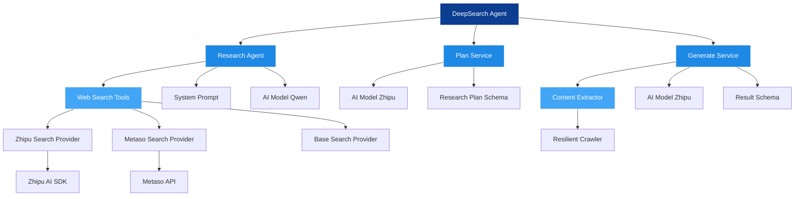

# DeepSearch Agent 原理说明

## 整体架构原理

DeepSearch Agent 是一个基于AI的深度研究代理系统，采用模块化设计，主要包含三个核心组件：

1. **Plan Service（规划服务）** - 负责制定研究计划
2. **Research Agent（研究代理）** - 执行具体的研究任务
3. **Generate Service（生成服务）** - 生成最终研究报告

## 工作流程原理

### 1. 研究规划阶段
- 用户输入研究主题后，系统首先调用Plan Service
- 使用AI模型分析主题，生成结构化的研究计划
- 计划包含多个研究要点，每个要点有具体的待办事项列表
- 同时计算研究预算(工具调用次数上限)

### 2. 研究执行阶段
- Research Agent根据研究计划逐项执行
- 通过Web Search工具进行网络搜索获取信息
- 支持多种搜索提供商(Zhipu、Metaso等)
- 采用智能去重机制避免重复搜索
- 实施步数控制和提前停止策略以提高效率

### 3. 内容提取阶段
- 从搜索结果的URL中提取正文内容
- 使用Resilient Crawler进行网页抓取
- 通过AI模型提取结构化内容
- 过滤无效或错误的数据项

### 4. 报告生成阶段
- 将提取的有效内容作为上下文提供给AI模型
- 使用预定义的提示词模板指导AI生成结构化报告
- 输出符合规范的JSON格式研究报告

## 核心技术原理

### 搜索去重机制
- 维护会话内已见URL和查询集合
- 检测重复查询和新增URL数量
- 当连续搜索无新增信息时自动停止

### 爬虫容错设计
- 采用渐进式选择器尝试提取内容
- 支持多种浏览器配置(移动端/桌面端)
- 快速失败机制避免长时间等待

### AI模型协作
- 使用不同模型处理不同任务(Qwen用于研究，Zhipu用于规划和生成)
- 温度参数控制生成的随机性
- 结构化Schema约束输出格式

这种设计使得系统能够高效、准确地完成复杂的深度研究任务，同时通过多种机制保证了结果的质量和可靠性。

架构图


处理流水线时序：
```mermaid
sequenceDiagram
    participant User
    participant DeepSearchAgent
    participant PlanService
    participant ResearchAgent
    participant WebSearch
    participant ContentExtractor
    participant GenerateService
    
    User->>DeepSearchAgent: Submit research topic
    DeepSearchAgent->>PlanService: Generate research plan
    PlanService->>PlanService: Use AI to create plan
    PlanService-->>DeepSearchAgent: Return plan & budget
    DeepSearchAgent->>ResearchAgent: Execute research plan
    ResearchAgent->>WebSearch: Search web (tools)
    WebSearch->>WebSearch: Query providers
    WebSearch-->>ResearchAgent: Return search results
    ResearchAgent->>ResearchAgent: Analyze results
    ResearchAgent-->>DeepSearchAgent: Return research data
    DeepSearchAgent->>ContentExtractor: Extract content from URLs
    ContentExtractor->>ContentExtractor: Crawl & extract
    ContentExtractor-->>DeepSearchAgent: Return extracted content
    DeepSearchAgent->>GenerateService: Generate final report
    GenerateService->>GenerateService: Process with AI
    GenerateService-->>User: Return final report
    
    style DeepSearchAgent fill:#0b3d91,stroke:#f5f5f5,color:#ffffff
    style PlanService fill:#1e88e5,stroke:#f5f5f5,color:#ffffff
    style ResearchAgent fill:#1e88e5,stroke:#f5f5f5,color:#ffffff
    style WebSearch fill:#42a5f5,stroke:#f5f5f5,color:#ffffff
    style ContentExtractor fill:#42a5f5,stroke:#f5f5f5,color:#ffffff
    style GenerateService fill:#1e88e5,stroke:#f5f5f5,color:#ffffff
```

TODO：

- 当前本模块还处于实验阶段，未来会合并到主项目中。
- 目前用的方案是免费接口，效果一般。
- 提示词中英文混合，还没有整理统一。
- 还没有加入校验逻辑。
- 目前的多agent方案是自己原生实现的，没有使用开源包，代码质量不高。
- 搜索API暂用的zhipu和metaso，效果一般，没有针对搜索结果进行优化和校验。
- 长文写作agent待开发，目前找到了开源平替，还没有测试效果。
- 工作量不小，慢慢来吧~
- 后续尝试使用一下langchain的深度智能体框架deepagents，不自己从头写了。
